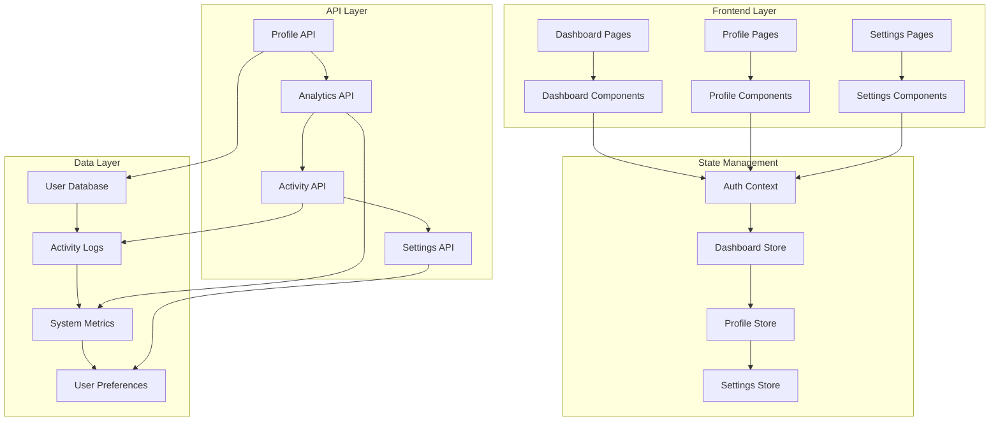

# Dashboard and Profile Management Design Document

## Overview

The Dashboard and Profile Management system provides users with a comprehensive interface to manage their account, view system analytics, monitor activity, and access key application features. The system builds upon the existing authentication infrastructure and extends it with rich dashboard functionality, profile management capabilities, and administrative tools.

The design emphasizes user experience through responsive layouts, real-time data updates, and intuitive navigation while maintaining security and performance standards.

## Architecture

### High-Level Architecture



### Component Architecture

The system follows a modular component architecture with clear separation of concerns:

- **Layout Components**: Provide consistent structure and navigation
- **Dashboard Components**: Handle data visualization and quick actions
- **Profile Components**: Manage user information and account settings
- **Settings Components**: Handle preferences and security configurations
- **Shared Components**: Reusable UI elements and utilities

## Components and Interfaces

### Core Components

#### DashboardLayout
- **Purpose**: Provides consistent layout structure with navigation and header
- **Props**: `children: ReactNode`
- **Features**: Responsive sidebar, user profile dropdown, notification center
- **State**: Sidebar visibility, dropdown states, active navigation item

#### ProfileManager
- **Purpose**: Handles profile information display and editing
- **Props**: `user: User, onUpdate: (updates: ProfileUpdates) => void`
- **Features**: Profile picture upload, form validation, password change
- **State**: Edit mode, form data, validation errors, loading states

#### AnalyticsDashboard
- **Purpose**: Displays system analytics and performance metrics
- **Props**: `timeRange: DateRange, filters: AnalyticsFilters`
- **Features**: Interactive charts, data filtering, export functionality
- **State**: Chart data, selected time range, active filters

#### ActivityMonitor
- **Purpose**: Shows recent user activity and system events
- **Props**: `activities: Activity[], limit?: number`
- **Features**: Real-time updates, activity filtering, detailed views
- **State**: Activity list, filter criteria, pagination

#### SettingsPanel
- **Purpose**: Manages user preferences and account configurations
- **Props**: `settings: UserSettings, onSave: (settings: UserSettings) => void`
- **Features**: Preference categories, security settings, notification controls
- **State**: Settings data, unsaved changes, validation status

### Interface Definitions

```typescript
interface DashboardStats {
  totalPipelines: number;
  activeExecutions: number;
  successRate: number;
  dataProcessed: string;
  lastUpdated: Date;
}

interface Activity {
  id: string;
  type: ActivityType;
  title: string;
  description: string;
  timestamp: Date;
  status?: 'success' | 'error' | 'warning';
  metadata?: Record<string, unknown>;
}

interface UserSettings {
  notifications: NotificationSettings;
  privacy: PrivacySettings;
  appearance: AppearanceSettings;
  security: SecuritySettings;
}

interface AnalyticsData {
  pipelineMetrics: PipelineMetrics[];
  executionTrends: ExecutionTrend[];
  errorRates: ErrorRate[];
  performanceMetrics: PerformanceMetric[];
}
```

## Data Models

### Extended User Model

```typescript
interface ExtendedUser extends User {
  // Profile information
  avatar?: string;
  bio?: string;
  timezone: string;
  language: string;
  
  // Account metadata
  accountType: 'free' | 'professional' | 'enterprise';
  subscriptionStatus: 'active' | 'inactive' | 'trial';
  lastLoginAt: Date;
  loginCount: number;
  
  // Preferences
  settings: UserSettings;
  
  // Security
  twoFactorEnabled: boolean;
  securityQuestions?: SecurityQuestion[];
}
```

### Dashboard Models

```typescript
interface DashboardData {
  stats: DashboardStats;
  recentActivity: Activity[];
  systemStatus: SystemStatus;
  quickActions: QuickAction[];
}

interface SystemStatus {
  api: ServiceStatus;
  database: ServiceStatus;
  queueProcessing: ServiceStatus;
  lastChecked: Date;
}

interface ServiceStatus {
  status: 'operational' | 'degraded' | 'down';
  responseTime?: number;
  uptime?: number;
}
```

### Analytics Models

```typescript
interface PipelineMetrics {
  pipelineId: string;
  name: string;
  executionCount: number;
  successRate: number;
  averageExecutionTime: number;
  dataProcessed: number;
  lastExecuted: Date;
}

interface ExecutionTrend {
  date: Date;
  executions: number;
  successes: number;
  failures: number;
  averageTime: number;
}
```

### Activity Models

```typescript
interface ActivityLog {
  id: string;
  userId: string;
  sessionId: string;
  type: ActivityType;
  resource: string;
  action: string;
  details: Record<string, unknown>;
  ipAddress: string;
  userAgent: string;
  timestamp: Date;
}

type ActivityType = 
  | 'user_login' | 'user_logout' | 'profile_update'
  | 'pipeline_created' | 'pipeline_updated' | 'pipeline_deleted'
  | 'pipeline_executed' | 'settings_changed' | 'security_event';
```

## Correctness Properties

*A property is a characteristic or behavior that should hold true across all valid executions of a system-essentially, a formal statement about what the system should do. Properties serve as the bridge between human-readable specifications and machine-verifiable correctness guarantees.*

Property 1: Dashboard authentication display
*For any* authenticated user, when accessing the dashboard, the system should display the main dashboard interface with navigation menu
**Validates: Requirements 1.1**

Property 2: Dashboard statistics display
*For any* dashboard load, the system should show user statistics including total pipelines, recent activity count, and account status
**Validates: Requirements 1.2**

Property 3: Dashboard quick actions availability
*For any* dashboard display, the system should provide quick access buttons to create new pipelines, view analytics, and manage settings
**Validates: Requirements 1.3**

Property 4: Session timeout warning
*For any* user session inactive for more than 30 minutes, the system should display a session timeout warning
**Validates: Requirements 1.4**

Property 5: Admin privilege display
*For any* user with admin privileges, the dashboard should display additional administrative controls
**Validates: Requirements 1.5**

Property 6: Profile information display
*For any* user accessing the profile section, the system should display current profile information including name, email, and account creation date
**Validates: Requirements 2.1**

Property 7: Profile input validation
*For any* profile field modification, the system should validate the input data before allowing updates
**Validates: Requirements 2.2**

Property 8: Profile update confirmation
*For any* profile changes submitted, the system should save the updates and display a confirmation message
**Validates: Requirements 2.3**

Property 9: Profile error handling
*For any* invalid data entered, the system should prevent submission and display specific error messages
**Validates: Requirements 2.4**

Property 10: Profile picture validation
*For any* profile picture upload, the system should validate file type and size before processing
**Validates: Requirements 2.5**

Property 11: Settings options display
*For any* user accessing account settings, the system should display options for password change, notification preferences, and privacy settings
**Validates: Requirements 3.1**

Property 12: Password change security
*For any* password change attempt, the system should require current password verification and enforce password strength requirements
**Validates: Requirements 3.2**

Property 13: Notification preferences persistence
*For any* notification preferences update, the system should save the changes and apply them immediately
**Validates: Requirements 3.3**

Property 14: Two-factor authentication setup
*For any* user enabling two-factor authentication, the system should guide them through the setup process with QR code generation
**Validates: Requirements 3.4**

Property 15: Privacy settings updates
*For any* privacy settings modification, the system should update data sharing preferences and display the changes
**Validates: Requirements 3.5**

Property 16: Analytics charts display
*For any* user viewing the analytics section, the system should display charts showing pipeline creation trends, execution statistics, and error rates
**Validates: Requirements 4.1**

Property 17: Recent activity display limits
*For any* recent activity display, the system should show the last 50 user actions with timestamps and action types
**Validates: Requirements 4.2**

Property 18: Analytics default aggregation
*For any* analytics data request, the system should aggregate data from the last 30 days by default
**Validates: Requirements 4.3**

Property 19: Analytics filtering updates
*For any* analytics date range filter, the system should update charts and statistics to reflect the selected period
**Validates: Requirements 4.4**

Property 20: Analytics data export
*For any* analytics data export request, the system should generate downloadable reports in CSV format
**Validates: Requirements 4.5**

Property 21: Mobile responsive layout
*For any* dashboard access on mobile devices, the system should adapt the layout for smaller screens with collapsible navigation
**Validates: Requirements 5.1**

Property 22: Navigation consistency
*For any* navigation between sections, the system should maintain consistent styling and smooth transitions
**Validates: Requirements 5.2**

Property 23: Screen size adaptation
*For any* screen size change, the system should automatically adjust component layouts without losing functionality
**Validates: Requirements 5.3**

Property 24: Keyboard navigation accessibility
*For any* keyboard navigation usage, the system should provide accessible focus indicators and tab order
**Validates: Requirements 5.4**

Property 25: Dark mode consistency
*For any* user with dark mode enabled, the system should apply the dark theme consistently across all components
**Validates: Requirements 5.5**

Property 26: Admin panel access
*For any* user with admin privileges accessing the admin panel, the system should display system-wide statistics and user management tools
**Validates: Requirements 6.1**

Property 27: Audit trail display
*For any* user activity log viewing, the system should show detailed audit trails with IP addresses and session information
**Validates: Requirements 6.2**

Property 28: System alert notifications
*For any* system alert trigger, the system should display notifications for security events and performance issues
**Validates: Requirements 6.3**

Property 29: Admin user management
*For any* admin managing user accounts, the system should allow viewing, modifying, and deactivating user profiles
**Validates: Requirements 6.4**

Property 30: Suspicious activity detection
*For any* suspicious activity detected, the system should automatically flag accounts and notify administrators
**Validates: Requirements 6.5**

<function_calls>
<invoke name="prework">
<parameter name="featureName">dashboard-profile-management

## Error Handling

### Client-Side Error Handling

The system implements comprehensive error handling at multiple levels:

#### Form Validation Errors
- **Input Validation**: Real-time validation with immediate feedback
- **Submission Errors**: Server-side validation errors displayed contextually
- **Network Errors**: Graceful handling of connectivity issues with retry mechanisms

#### Data Loading Errors
- **API Failures**: Fallback to cached data when available
- **Timeout Handling**: Progressive loading with timeout indicators
- **Partial Data**: Graceful degradation when some data is unavailable

#### User Experience Errors
- **Session Expiry**: Automatic refresh with user notification
- **Permission Errors**: Clear messaging for unauthorized actions
- **File Upload Errors**: Detailed feedback for upload failures

### Server-Side Error Handling

#### API Error Responses
```typescript
interface APIError {
  code: string;
  message: string;
  details?: Record<string, unknown>;
  timestamp: Date;
  requestId: string;
}
```

#### Error Categories
- **Validation Errors**: Input data validation failures
- **Authentication Errors**: Session and permission issues
- **Business Logic Errors**: Application-specific constraint violations
- **System Errors**: Database and infrastructure failures

### Error Recovery Strategies

#### Automatic Recovery
- **Retry Logic**: Exponential backoff for transient failures
- **Circuit Breaker**: Prevent cascade failures
- **Graceful Degradation**: Maintain core functionality during partial outages

#### User-Initiated Recovery
- **Manual Refresh**: User-triggered data reload
- **Error Reporting**: Built-in error reporting mechanism
- **Alternative Paths**: Fallback workflows for critical operations

## Testing Strategy

### Dual Testing Approach

The system employs both unit testing and property-based testing to ensure comprehensive coverage:

#### Unit Testing
- **Component Testing**: Individual React component behavior
- **API Integration**: Endpoint functionality and error handling
- **Business Logic**: Core functionality validation
- **User Interactions**: Form submissions, navigation, and state changes

#### Property-Based Testing
- **Framework**: Jest with fast-check for property-based testing
- **Test Configuration**: Minimum 100 iterations per property test
- **Property Validation**: Each correctness property implemented as a single property-based test
- **Test Tagging**: Each property test tagged with format: `**Feature: dashboard-profile-management, Property {number}: {property_text}**`

### Testing Categories

#### Functional Testing
- **Authentication Flow**: Login, logout, session management
- **Profile Management**: CRUD operations, validation, file uploads
- **Dashboard Display**: Data loading, statistics calculation, real-time updates
- **Settings Management**: Preference updates, security configurations

#### Integration Testing
- **API Integration**: End-to-end API communication
- **Database Operations**: Data persistence and retrieval
- **File Upload**: Profile picture and document handling
- **External Services**: Email notifications, analytics services

#### Performance Testing
- **Load Testing**: Dashboard performance under concurrent users
- **Response Time**: API endpoint performance benchmarks
- **Memory Usage**: Client-side memory consumption monitoring
- **Bundle Size**: JavaScript bundle optimization validation

#### Security Testing
- **Authentication**: Session security and token validation
- **Authorization**: Role-based access control verification
- **Input Sanitization**: XSS and injection prevention
- **Data Privacy**: Personal information protection compliance

#### Accessibility Testing
- **Keyboard Navigation**: Full keyboard accessibility
- **Screen Reader**: ARIA compliance and semantic markup
- **Color Contrast**: WCAG 2.1 AA compliance
- **Focus Management**: Proper focus handling and indicators

### Test Data Management

#### Mock Data Strategy
- **User Profiles**: Diverse user scenarios and edge cases
- **Analytics Data**: Realistic time-series and statistical data
- **Activity Logs**: Comprehensive activity type coverage
- **System Status**: Various system health scenarios

#### Test Environment Setup
- **Database Seeding**: Consistent test data across environments
- **API Mocking**: Reliable test execution without external dependencies
- **File System**: Temporary file handling for upload tests
- **Time Simulation**: Controlled time-based testing scenarios