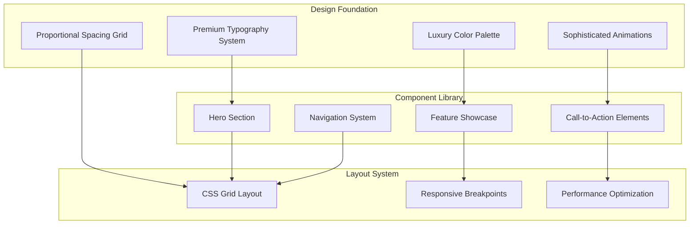

# FlowForge Landing Page Design Document

## Overview

The FlowForge Landing Page represents the pinnacle of luxury web design, serving as a sophisticated digital gateway that introduces potential users to the FlowForge visual data pipeline platform. The design philosophy centers on minimalistic elegance, premium typography, and refined visual hierarchy to create an immediate sense of quality and trustworthiness.

The landing page employs a carefully curated aesthetic that balances visual sophistication with functional clarity. Through strategic use of whitespace, premium color palettes, and thoughtful micro-interactions, the design communicates FlowForge's commitment to excellence while guiding users seamlessly through the conversion funnel.

Built with Next.js and styled using Tailwind CSS with custom design tokens, the page prioritizes performance without compromising visual fidelity. The responsive design system ensures the luxury experience translates perfectly across all devices, from desktop workstations to mobile phones.

## Architecture

### Design System Architecture



### Technical Architecture

The landing page follows a component-based architecture optimized for performance and maintainability:

- **Next.js App Router**: Server-side rendering for optimal SEO and initial load performance
- **Tailwind CSS**: Utility-first styling with custom design tokens for luxury aesthetics
- **Framer Motion**: Sophisticated animations and micro-interactions
- **Next/Image**: Optimized image delivery with responsive sizing
- **Custom Fonts**: Premium typography loaded with optimal performance strategies

## Components and Interfaces

### Core Components

#### HeroSection
```typescript
interface HeroSection {
  headline: string
  subheadline: string
  primaryCTA: CallToAction
  secondaryCTA?: CallToAction
  backgroundElement: BackgroundGraphic
  
  animateIn(): void
  handleCTAClick(type: 'primary' | 'secondary'): void
}
```

#### FeatureShowcase
```typescript
interface FeatureShowcase {
  features: Feature[]
  layout: 'grid' | 'carousel' | 'stacked'
  animationTrigger: 'scroll' | 'hover' | 'auto'
  
  renderFeature(feature: Feature): JSX.Element
  handleFeatureInteraction(featureId: string): void
}

interface Feature {
  id: string
  title: string
  description: string
  icon: IconComponent
  visual?: ImageAsset
  hoverState: InteractionState
}
```

#### LuxuryButton
```typescript
interface LuxuryButton {
  variant: 'primary' | 'secondary' | 'ghost'
  size: 'small' | 'medium' | 'large'
  children: React.ReactNode
  onClick: () => void
  disabled?: boolean
  loading?: boolean
  
  hoverAnimation: MotionConfig
  pressAnimation: MotionConfig
}
```

#### ResponsiveLayout
```typescript
interface ResponsiveLayout {
  breakpoints: BreakpointConfig
  gridSystem: GridConfig
  spacingScale: SpacingConfig
  
  adaptLayout(viewport: ViewportSize): LayoutConfig
  calculateSpacing(level: number): string
  getGridColumns(breakpoint: string): number
}
```

### Data Models

#### DesignTokens
```typescript
interface DesignTokens {
  colors: ColorPalette
  typography: TypographySystem
  spacing: SpacingScale
  shadows: ShadowSystem
  animations: AnimationConfig
}

interface ColorPalette {
  primary: {
    50: string   // Lightest purple
    100: string
    500: string  // Brand purple
    900: string  // Darkest purple
  }
  neutral: {
    0: string    // Pure white
    50: string   // Off white
    100: string  // Light gray
    800: string  // Dark gray
    900: string  // Near black
  }
  accent: {
    gold: string
    silver: string
  }
}

interface TypographySystem {
  fontFamilies: {
    display: string    // For headlines
    body: string       // For body text
    mono: string       // For code elements
  }
  fontSizes: {
    xs: string
    sm: string
    base: string
    lg: string
    xl: string
    '2xl': string
    '3xl': string
    '4xl': string
    '5xl': string
    '6xl': string
  }
  fontWeights: {
    light: number
    normal: number
    medium: number
    semibold: number
    bold: number
  }
  lineHeights: {
    tight: number
    normal: number
    relaxed: number
  }
}
```

#### AnimationConfig
```typescript
interface AnimationConfig {
  durations: {
    fast: number      // 150ms
    normal: number    // 300ms
    slow: number      // 500ms
    slower: number    // 750ms
  }
  easings: {
    easeOut: string
    easeInOut: string
    spring: SpringConfig
  }
  transitions: {
    fadeIn: MotionVariant
    slideUp: MotionVariant
    scaleIn: MotionVariant
    stagger: StaggerConfig
  }
}
```

#### PerformanceMetrics
```typescript
interface PerformanceMetrics {
  targetLCP: number        // 2.5 seconds
  targetFID: number        // 100ms
  targetCLS: number        // 0.1
  
  imageOptimization: ImageConfig
  fontLoading: FontLoadingStrategy
  criticalCSS: CSSOptimization
}
```

## Correctness Properties

*A property is a characteristic or behavior that should hold true across all valid executions of a system-essentially, a formal statement about what the system should do. Properties serve as the bridge between human-readable specifications and machine-verifiable correctness guarantees.*

Before defining correctness properties, let me analyze the acceptance criteria for testability:

### Property Reflection

After analyzing all acceptance criteria, several properties can be consolidated to eliminate redundancy:

- Typography properties (1.2, 2.3, 2.4, 6.1) can be combined into a comprehensive typography consistency property
- Styling and aesthetic properties (1.3, 1.5, 5.3, 6.3, 6.4) can be unified into a luxury design system property
- Animation properties (1.4, 2.2, 2.5, 5.4) can be consolidated into interaction and animation consistency
- Performance properties (4.1, 4.2, 4.3, 4.4, 4.5) can be combined into comprehensive performance benchmarks
- Responsive properties (3.1, 3.2, 3.5) can be unified into responsive design consistency

### Core Properties

**Property 1: Hero Section Load Performance**
*For any* user visit, the hero section should display with clear value proposition and load completely within 2.5 seconds
**Validates: Requirements 1.1, 4.1**

**Property 2: Typography System Consistency**
*For any* text element on the page, the typography should use fonts, weights, and sizes from the defined minimalistic design system with proper hierarchy
**Validates: Requirements 1.2, 2.3, 2.4, 6.1**

**Property 3: Luxury Design System Application**
*For any* visual element, the styling should consistently apply colors, spacing, and visual patterns from the luxury design system
**Validates: Requirements 1.3, 1.5, 5.3, 6.3, 6.4**

**Property 4: Feature Showcase Content Requirements**
*For any* feature showcase section, it should display at least 4 features with elegant visual representations and proper formatting
**Validates: Requirements 2.1**

**Property 5: Interactive Animation Consistency**
*For any* interactive element, hover and scroll-triggered animations should execute with sophisticated timing and maintain luxury aesthetic
**Validates: Requirements 1.4, 2.2, 2.5, 5.4**

**Property 6: Responsive Design Preservation**
*For any* viewport size, the layout should adapt while preserving luxury aesthetic, proper typography scaling, and spacing ratios
**Validates: Requirements 3.1, 3.2, 3.5**

**Property 7: Touch Interaction Feedback**
*For any* interactive element on touch devices, touch events should provide appropriate visual feedback that maintains premium feel
**Validates: Requirements 3.3**

**Property 8: Image Optimization Consistency**
*For any* image asset, the system should serve optimized versions appropriate for the device's screen density and prevent layout shifts
**Validates: Requirements 3.4, 4.3**

**Property 9: Performance Benchmark Compliance**
*For any* page interaction or animation, the system should maintain 60fps performance and provide immediate visual feedback
**Validates: Requirements 4.2, 4.5**

**Property 10: Resource Loading Optimization**
*For any* page load, critical CSS should be prioritized and non-essential resources deferred to optimize initial rendering
**Validates: Requirements 4.4**

**Property 11: Call-to-Action Visibility**
*For any* scroll position on the page, at least one clear call-to-action should be visible within the viewport
**Validates: Requirements 5.1**

**Property 12: Navigation Functionality**
*For any* primary action button click, the system should correctly navigate to the FlowForge application or signup flow
**Validates: Requirements 5.2**

**Property 13: Visual Hierarchy Consistency**
*For any* section with multiple CTAs, primary and secondary actions should maintain clear visual hierarchy while preserving aesthetic harmony
**Validates: Requirements 5.5**

**Property 14: Grid System Compliance**
*For any* layout element, spacing and positioning should follow the consistent grid system and proportional relationships
**Validates: Requirements 6.2**

**Property 15: Whitespace and Composition Excellence**
*For any* visual composition, whitespace usage should create a sense of luxury through thoughtful spacing and premium material application
**Validates: Requirements 6.5**

## Error Handling

### Client-Side Error Handling

**Loading and Performance Errors**
- Slow network connections trigger progressive enhancement with skeleton loading states
- Failed image loads display elegant placeholder graphics maintaining visual hierarchy
- Font loading failures gracefully fallback to system fonts with similar characteristics
- Animation performance issues automatically reduce motion complexity for smooth experience

**Responsive Design Errors**
- Viewport detection failures default to mobile-first responsive behavior
- CSS Grid support issues fallback to flexbox layouts maintaining visual integrity
- Touch interaction problems on hybrid devices provide both touch and mouse interaction patterns
- Screen density detection errors serve standard resolution images with appropriate sizing

**User Interaction Errors**
- Failed navigation attempts display elegant error states with alternative pathways
- Broken scroll animations degrade gracefully to instant content reveals
- Hover state failures on touch devices provide tap-based interaction alternatives
- Form submission errors (if present) maintain luxury aesthetic with clear error messaging

### Graceful Degradation Strategies

**Progressive Enhancement**
- Core content and navigation remain functional without JavaScript
- Basic styling preserved when advanced CSS features unavailable
- Essential CTAs remain accessible across all browser capabilities
- Fundamental responsive behavior maintained with CSS-only solutions

**Performance Fallbacks**
- Reduced animation complexity on lower-powered devices
- Simplified visual effects when GPU acceleration unavailable
- Optimized image delivery based on connection speed detection
- Minimal viable experience for extremely constrained environments

## Testing Strategy

### Dual Testing Approach

The testing strategy employs both unit testing and property-based testing to ensure comprehensive coverage:

- **Unit tests** verify specific visual components, interaction behaviors, and responsive breakpoints
- **Property-based tests** verify design system consistency, performance benchmarks, and cross-device compatibility using fast-check library
- Together they provide complete coverage: unit tests catch specific implementation bugs, property tests verify design system adherence

### Unit Testing Requirements

Unit tests focus on:
- Component rendering with correct styling and content
- Responsive breakpoint behavior and layout adaptations
- Animation timing and interaction state management
- Image optimization and loading behavior
- Navigation functionality and CTA click handling

### Property-Based Testing Requirements

Property-based tests use the **fast-check** library for JavaScript/TypeScript and are configured to run a minimum of **100 iterations** per test. Each property-based test includes a comment explicitly referencing the corresponding correctness property using the format: **Feature: flowforge-landing-page, Property {number}: {property_text}**

Key property test areas:
- Design system consistency across all components and states
- Performance benchmarks under various network and device conditions
- Responsive behavior across continuous viewport size ranges
- Animation and interaction consistency across different user agents
- Typography and spacing adherence to design token specifications

### Visual Regression Testing

**Design System Validation**
- Automated screenshot comparison across multiple browsers and devices
- Color palette accuracy verification against design specifications
- Typography rendering consistency across different operating systems
- Spacing and alignment precision testing with pixel-perfect accuracy

**Cross-Browser Compatibility**
- Luxury aesthetic preservation across Chrome, Firefox, Safari, and Edge
- Responsive behavior validation on various device simulators
- Performance benchmark testing across different browser engines
- Accessibility compliance testing with screen readers and keyboard navigation

### Performance Testing

**Core Web Vitals Monitoring**
- Largest Contentful Paint (LCP) measurement under various network conditions
- First Input Delay (FID) testing across different device capabilities
- Cumulative Layout Shift (CLS) monitoring during image and font loading
- Time to Interactive (TTI) optimization validation

**Animation Performance**
- Frame rate monitoring during scroll and hover animations
- GPU usage optimization testing for complex visual effects
- Memory consumption tracking during extended user sessions
- Battery impact assessment on mobile devices during animation-heavy interactions