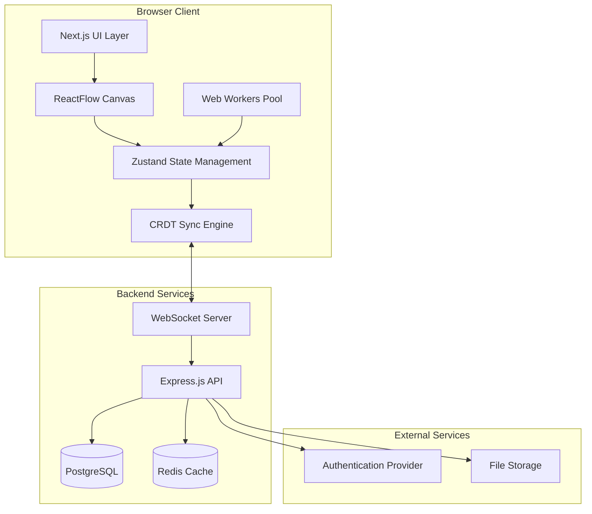

# FlowForge Design Document

## Overview

FlowForge is a browser-based, real-time collaborative visual data pipeline builder that enables teams to create, execute, and debug data transformations through an intuitive node-based interface. The system combines the flexibility of visual programming with the power of real-time collaboration, allowing multiple users to simultaneously design pipelines while seeing live data previews at every stage.

The architecture prioritizes client-side execution for performance and security, using Web Workers for non-blocking data processing and CRDT-based synchronization for conflict-free collaboration. Built with Next.js and ReactFlow, the platform provides a modern, responsive interface with a purple-themed aesthetic optimized for data engineering workflows.

## Architecture

### High-Level Architecture



### Client-Side Architecture

The client follows a layered architecture with clear separation of concerns:

- **Presentation Layer**: Next.js components with Tailwind CSS styling
- **Canvas Layer**: ReactFlow for visual node manipulation and rendering
- **State Management**: Zustand stores for pipeline state, collaboration, and UI state
- **Execution Layer**: Web Workers for data processing and transformation
- **Synchronization Layer**: CRDT implementation for real-time collaboration

### Backend Architecture

The backend provides minimal services focused on collaboration and persistence:

- **WebSocket Server**: Real-time synchronization and presence tracking
- **REST API**: Pipeline CRUD operations and user management
- **Database Layer**: PostgreSQL for persistent storage with Redis for caching
- **Authentication**: JWT-based authentication with session management

## Components and Interfaces

### Core Components

#### PipelineCanvas
```typescript
interface PipelineCanvas {
  nodes: PipelineNode[]
  edges: PipelineEdge[]
  viewport: Viewport
  selectedNodes: string[]
  
  addNode(type: NodeType, position: Position): void
  removeNode(nodeId: string): void
  connectNodes(sourceId: string, targetId: string): void
  updateNodeConfig(nodeId: string, config: NodeConfig): void
}
```

#### PipelineNode
```typescript
interface PipelineNode {
  id: string
  type: NodeType
  position: Position
  data: NodeData
  config: NodeConfig
  status: 'idle' | 'processing' | 'success' | 'error'
  preview?: DataPreview
}

type NodeType = 
  | 'api-fetch' | 'csv-upload' | 'json-parser'
  | 'filter' | 'map' | 'reduce' | 'aggregate'
  | 'join' | 'sort' | 'limit' | 'rename-fields'
  | 'math-transform' | 'group-by' | 'preview' | 'export'
```

#### ExecutionEngine
```typescript
interface ExecutionEngine {
  executeNode(node: PipelineNode, inputData: any[]): Promise<any[]>
  executePipeline(pipeline: Pipeline): Promise<ExecutionResult>
  validatePipeline(pipeline: Pipeline): ValidationResult
  
  registerNodeProcessor(type: NodeType, processor: NodeProcessor): void
}
```

#### CollaborationManager
```typescript
interface CollaborationManager {
  joinSession(pipelineId: string): Promise<void>
  leaveSession(): void
  broadcastChange(change: PipelineChange): void
  applyCRDTOperation(operation: CRDTOperation): void
  
  onUserJoined(callback: (user: User) => void): void
  onUserLeft(callback: (userId: string) => void): void
  onCursorMove(callback: (userId: string, position: Position) => void): void
}
```

### Node Processors

Each node type implements a standardized processor interface:

```typescript
interface NodeProcessor {
  validate(config: NodeConfig): ValidationResult
  execute(data: any[], config: NodeConfig): Promise<any[]>
  getSchema(config: NodeConfig): DataSchema
  getPreview(data: any[], config: NodeConfig): DataPreview
}
```

### Data Models

#### Pipeline
```typescript
interface Pipeline {
  id: string
  name: string
  description?: string
  nodes: PipelineNode[]
  edges: PipelineEdge[]
  createdBy: string
  createdAt: Date
  updatedAt: Date
  version: number
}
```

#### DataPreview
```typescript
interface DataPreview {
  sample: any[]
  totalRows: number
  schema: DataSchema
  errors?: string[]
}

interface DataSchema {
  fields: SchemaField[]
}

interface SchemaField {
  name: string
  type: 'string' | 'number' | 'boolean' | 'date' | 'object' | 'array'
  nullable: boolean
}
```

#### CollaborationState
```typescript
interface CollaborationState {
  sessionId: string
  activeUsers: User[]
  cursors: Map<string, Position>
  pendingOperations: CRDTOperation[]
  lastSyncTimestamp: number
}
```

## Correctness Properties

*A property is a characteristic or behavior that should hold true across all valid executions of a system-essentially, a formal statement about what the system should do. Properties serve as the bridge between human-readable specifications and machine-verifiable correctness guarantees.*

### Property Reflection

After analyzing all acceptance criteria, several properties can be consolidated to eliminate redundancy:

- Properties related to data preview updates (2.1, 2.2, 4.4) can be combined into a comprehensive data flow property
- Node validation properties (1.4, 5.2, 5.4) can be unified into a general validation property
- Export properties (5.5, 7.1, 7.2, 7.3) can be consolidated into code generation round-trip properties
- UI feedback properties (8.2, 8.4) can be combined into a single user interaction feedback property

### Core Properties

**Property 1: Node Creation and Positioning**
*For any* node type and canvas position, dragging a node from the palette to the canvas should create a new node instance at the exact drop location with correct type and default configuration
**Validates: Requirements 1.2**

**Property 2: Node Connection Establishment**
*For any* pair of compatible nodes, connecting them with an edge should establish a bidirectional data flow relationship that can be traversed during execution
**Validates: Requirements 1.3**

**Property 3: Pipeline Serialization Round-trip**
*For any* valid pipeline configuration, serializing to JSON and then deserializing should produce an equivalent pipeline with identical nodes, edges, and configurations
**Validates: Requirements 1.5**

**Property 4: Node Validation Consistency**
*For any* node configuration, the validation result should be deterministic and accurately reflect whether the configuration is valid for execution
**Validates: Requirements 1.4, 5.2, 5.4**

**Property 5: Data Flow and Preview Updates**
*For any* pipeline with connected nodes, when input data changes or node configurations are modified, all downstream previews should update to reflect the new data transformations
**Validates: Requirements 2.1, 2.2, 4.4**

**Property 6: Error Propagation and Display**
*For any* pipeline execution that encounters errors, the system should halt processing at the failing node and display error details without affecting upstream successful transformations
**Validates: Requirements 2.3, 4.5**

**Property 7: Schema Detection and Display**
*For any* data preview, the system should correctly identify and display schema information including field names, data types, and nullability for all columns
**Validates: Requirements 2.4**

**Property 8: Data Sampling Consistency**
*For any* dataset exceeding display limits, the preview should show a representative sample with accurate row count indicators that reflect the total dataset size
**Validates: Requirements 2.5**

**Property 9: CRDT Conflict Resolution**
*For any* set of concurrent operations on the same pipeline, applying CRDT merge operations should result in a consistent final state without data loss, regardless of operation order
**Validates: Requirements 3.3**

**Property 10: Collaboration State Synchronization**
*For any* collaborative session, when users join or perform actions, the system should broadcast state changes and cursor positions to all connected clients
**Validates: Requirements 3.2, 3.4**

**Property 11: Pipeline Execution Validation**
*For any* pipeline, execution should only proceed if all nodes are properly connected, configured, and form a valid directed acyclic graph
**Validates: Requirements 4.2**

**Property 12: Execution Order Correctness**
*For any* connected pipeline, nodes should execute in topological order based on their dependencies, ensuring that each node receives processed data from all upstream nodes
**Validates: Requirements 4.3**

**Property 13: Web Worker Execution Isolation**
*For any* pipeline execution, data processing should occur in Web Workers without blocking the main UI thread
**Validates: Requirements 4.1**

**Property 14: CSV Parsing and Type Detection**
*For any* valid CSV file, the parser should correctly identify column headers and automatically detect appropriate data types for each column
**Validates: Requirements 5.3**

**Property 15: Export Format Consistency**
*For any* pipeline results, exporting to JSON or CSV format should produce valid, parseable output that preserves data integrity and structure
**Validates: Requirements 5.5**

**Property 16: Version Management**
*For any* pipeline modification, the system should automatically create a new version with timestamp, and version restoration should exactly reproduce the selected pipeline state
**Validates: Requirements 6.1, 6.4**

**Property 17: Version Comparison Accuracy**
*For any* two pipeline versions, the comparison should correctly identify and highlight all added, removed, and modified nodes with their specific changes
**Validates: Requirements 6.3**

**Property 18: Code Generation Round-trip**
*For any* pipeline that can be exported to JavaScript, Python, or SQL, executing the generated code should produce results equivalent to the original pipeline execution
**Validates: Requirements 7.1, 7.2, 7.3**

**Property 19: Export Metadata Preservation**
*For any* code export, the generated output should include the original pipeline JSON configuration as metadata comments or embedded data
**Validates: Requirements 7.5**

**Property 20: UI Responsiveness and Feedback**
*For any* user interaction (hover, selection, configuration), the system should provide immediate visual feedback and display appropriate error messages for invalid inputs
**Validates: Requirements 8.2, 8.4**

**Property 21: Responsive Layout Adaptation**
*For any* screen size or device orientation, the interface should maintain usability by adapting layout, scaling elements, and preserving core functionality
**Validates: Requirements 8.3**

**Property 22: Canvas Navigation Operations**
*For any* canvas state, zoom, pan, and auto-align operations should maintain visual consistency and preserve node relationships while providing smooth user experience
**Validates: Requirements 8.5**

## Error Handling

### Client-Side Error Handling

**Node Execution Errors**
- Invalid configurations trigger immediate validation feedback
- Runtime errors during data processing are caught and displayed inline
- Schema mismatches prevent invalid connections with clear warnings
- Network errors in API nodes show retry options and fallback states

**Collaboration Errors**
- WebSocket disconnections trigger automatic reconnection with exponential backoff
- CRDT operation conflicts are resolved automatically with user notification
- Sync failures maintain local state with conflict resolution on reconnection
- Session timeouts preserve work with automatic session renewal

**Data Processing Errors**
- Large dataset processing includes progress indicators and cancellation options
- Memory limits in Web Workers trigger graceful degradation with sampling
- File upload errors provide specific feedback (format, size, corruption)
- Export failures maintain partial results with error reporting

### Error Recovery Strategies

**Graceful Degradation**
- Offline mode maintains core functionality with local storage
- Reduced collaboration features when WebSocket unavailable
- Simplified previews when processing resources are limited
- Basic export options when advanced code generation fails

**User Feedback**
- Toast notifications for transient errors with auto-dismiss
- Inline error states for persistent validation issues
- Modal dialogs for critical errors requiring user action
- Progress indicators for long-running operations with cancellation

## Testing Strategy

### Dual Testing Approach

The testing strategy employs both unit testing and property-based testing to ensure comprehensive coverage:

- **Unit tests** verify specific examples, edge cases, and integration points between components
- **Property-based tests** verify universal properties that should hold across all inputs using fast-check library
- Together they provide complete coverage: unit tests catch concrete bugs, property tests verify general correctness

### Unit Testing Requirements

Unit tests focus on:
- Specific examples demonstrating correct behavior for each node type
- Integration points between Canvas, ExecutionEngine, and CollaborationManager
- Error conditions and edge cases (empty data, malformed configurations)
- UI component rendering and user interaction handling
- WebSocket connection management and reconnection logic

### Property-Based Testing Requirements

Property-based tests use the **fast-check** library for JavaScript/TypeScript and are configured to run a minimum of **100 iterations** per test. Each property-based test includes a comment explicitly referencing the corresponding correctness property using the format: **Feature: flowforge-pipeline-builder, Property {number}: {property_text}**

Key property test areas:
- Data transformation correctness across all node types
- Pipeline serialization and deserialization round-trips
- CRDT operation commutativity and convergence
- Schema validation and type inference accuracy
- Code generation equivalence for export functionality

### Test Data Generation

**Smart Generators**
- Pipeline generators create valid node graphs with realistic configurations
- Data generators produce diverse datasets with various schemas and edge cases
- Configuration generators create both valid and invalid node parameters
- Collaboration generators simulate realistic multi-user interaction patterns

**Edge Case Coverage**
- Empty datasets and null values
- Large datasets exceeding memory limits
- Malformed CSV files and invalid JSON
- Network interruptions and reconnection scenarios
- Concurrent modifications and conflict resolution

### Integration Testing

**End-to-End Workflows**
- Complete pipeline creation, execution, and export workflows
- Multi-user collaboration scenarios with real-time synchronization
- Version control operations including branching and merging
- Cross-browser compatibility and responsive design validation

**Performance Testing**
- Large pipeline execution performance in Web Workers
- Real-time collaboration latency under various network conditions
- Memory usage during extensive data processing
- UI responsiveness during heavy computational loads